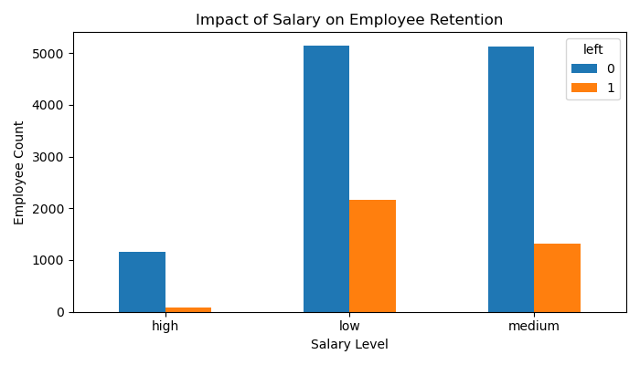

# HR Employee Retention Analysis & Prediction

📝 Project Overview
This project focuses on a crucial aspect of Human Resources (HR) management: Employee Retention.   

 By analyzing a dataset of current and past employees, 

the goal is to identify key factors that influence an employee's decision to leave the company
and to build a predictive model to forecast future attrition.

 <h3>The analysis follows a structured approach:</h3>

* Exploratory Data Analysis (EDA)

* Data Visualization 

* Model Building (Logistic Regression) 

* Accuracy Measurement.

<h3>Key Objectives</h3>

* Identify variables (e.g., salary, department, work-life balance) that have the most significant impact on employee turnover.

* Visualize the correlation between key features and the retention rate.

* Develop a Logistic Regression model to predict if an employee will leave the company.

* Measure and evaluate the model's accuracy.

<h3>⚙️ Setup and Installation</h3> 

  To run this project locally, you will need a Python environment with the following libraries installed.

<h3>Prerequisites</h3>
 * Python 3.x<br>  
* Jupyter Notebook (or an IDE like VS Code, Spyder)

<h3>Installation</h3>
  Clone the repository and install the required packages using pip:

  ```
    git clone https://github.com/your-username/hr-retention-analysis.git 
    cd hr-retention-analysis
    pip install pandas numpy matplotlib seaborn scikit-learn
 ```

<h3>Files in this Repository</h3>

hr_analysis_.ipynb: The main Jupyter Notebook containing all the data cleaning, EDA, visualizations, model training, and evaluation steps.

[HR_comma_sep.csv](HR_comma_sep.csv): The raw dataset used for the analysis (please ensure this file is included or link to its source).

<h3>🖼️ Key Visualizations</h3>
The visualizations section highlights critical relationships found during the Exploratory Data Analysis (EDA).<br> These charts provide clear insights into which employee characteristics correlate most strongly with the decision to leave the company.

<h3>1. Impact of Salary on Retention</h3>

A bar chart is used to compare the retention rate (Left vs. Stayed) across different salary levels (Low, Medium, High).<br>

 <h3>Insight:</h3><br> 
 * We observed a significantly higher turnover rate among employees with 'Low' salaries, indicating compensation is a major factor in attrition.<br></br>
 
 
